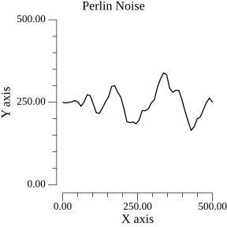
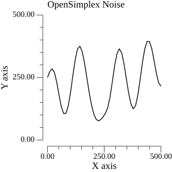
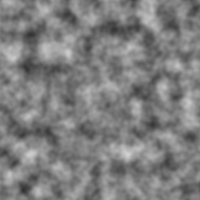
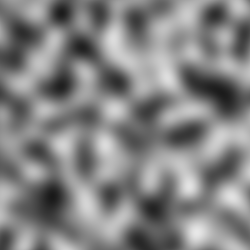

[](https://pkg.go.dev/github.com/KEINOS/go-noise/ "View document")
[](https://github.com/KEINOS/go-noise/actions/workflows/go-versions.yml)

# Go-Noise

[go-noise](https://github.com/KEINOS/go-noise) is a Go package for generating a gradient noise between -1 and 1.

It is a wrapper to facilitate the use of [go-perlin](https://github.com/aquilax/go-perlin) and [opensimplex-go](https://github.com/ojrac/opensimplex-go). And also to understand them better.

## 1D Example

In the example below, 1 dimmentional method `noise.Generator.Eval64(x)` was used to generate the noise value `y` at the position `(x)`.

```go
// import "github.com/KEINOS/go-noise"
//
// const seed = 100       // noise pattern ID
// const smoothness = 100 // noise smoothness
//
// noiseType := noise.Perlin
// noiseType := noise.OpenSimplex
n, err := noise.New(noiseType, seed)

yy := n.Eval64(x / smoothness) // yy is between -1.0 and 1.0 of float64
y := (yy + 1) / 2 * 500        // y is between 0 and 500
```




- [Source](./_example/2d)

## 2D Example

```go
// Obtain the noise value at the position (x, y)
n, err := noise.New(noiseType, seed)
v := n.Eval64(x, y) // v is between -1.0 and 1.0 of float64
```

To create a 2D image, plot the `v` value at the position `(x, y)` in the 2D space. The 2D image example is equivalent to a frame of the 3D image example below.

## 3D Example

In the example below, three dimmentional method `noise.Generator.Eval64(x, y, z)` was used to generate the noise value at the position `(x, y, z)`.

The `x` and `y` are the axes of 2D image and the `z` is the axis for "time", or animation frame, of the 3D noise sample.

### Perlin Noise Sample

```go
// Obtain the noise value at the position (x, y, z)
n, err := noise.New(noise.Perlin, seed)
v := n.Eval64(x, y, z) // v is between -1.0 and 1.0 of float64
```



- [Source](./_example/3d)

### OpenSimplex Noise Sample

```go
// Obtain the noise value at the position (x, y, z)
n, err := noise.New(noise.OpenSimplex, seed)
v := n.Eval64(x, y, z) // v is between -1.0 and 1.0 of float64
```



- [Source](./_example/3d)

### Note

This package ONLY supports up to 3 dimensions. If more than 3 dimentions were given, such as `noise.Generator.Eval64(w, x, y, z)`, it will retrun a `0` (zero) value.

## Usage

### Require module

```bash
go get "github.com/KEINOS/go-noise"
```

### Constructor

```go
import "github.com/KEINOS/go-noise"

// Seed is like pattern ID.
// If the seed values are the same, the noise pattern will also be the
// same.
const seed = 100

// Noise generator for Perlin noise
genNoise, err := noise.New(noise.Perlin, seed)
```
```go
import "github.com/KEINOS/go-noise"

// Seed is like pattern ID.
// If the seed values are the same, the noise pattern will also be the
// same.
const seed = 100

// Noise generator for OpenSimplex noise
genNoise, err := noise.New(noise.OpenSimplex, seed)
```

### Methods

```go
a := genNoise.Eval32(x)       // 1D noise. Generate noise at x.
b := genNoise.Eval32(x, y)    // 2D noise. Generate noise at x, y.
c := genNoise.Eval32(x, y, z) // 3D noise. Generate noise at x, y, z.

// a, b, c, x, y, z are float32.
// Noises a, b, c are between -1.0 and 1.0.
```
```go
a := genNoise.Eval64(x)       // 1D noise. Generate noise at x.
b := genNoise.Eval64(x, y)    // 2D noise. Generate noise at x, y.
c := genNoise.Eval64(x, y, z) // 3D noise. Generate noise at x, y, z.

// a, b, c, x, y, z are float64.
// Noises a, b, c are between -1.0 and 1.0.
```

### Brief Example

```go
import "github.com/KEINOS/go-noise"

const seed = 100
const frame = 50

// Create new noise generator of Perlin type
genNoise, err := noise.New(noise.Perlin, seed)

if err != nil {
    // error handle
}

for z := 0; z < frame; z++ {
    zz := float64(z) / 5 // smoothness between frames

    /* Here create a new image of a frame */

    for y := 0; y < height; y++ {
        yy := float64(y) / 25 // smoothness between plotting points

        for x := 0; x < width; x++ {
            xx := float64(x) / 25 // smoothness between plotting points

            // n is a float64 value between -1 and 1
            n := genNoise.Eval64(xx, yy, zz)

            // Convert n to 0-255 scale
            grayColor := ((1. - in) / 2.) * 255.

            pixelToPlot := color.Gray{Y: uint8(grayColor)}

            /* Here plot the pixel to the current image */
        }
    }

    /* Here save the current frame/image to a file */
}

/* Here animate the frames if you want */
```

- [Complete Source](./_example/3d)

## Contribute

[](https://github.com/KEINOS/go-noise/actions/workflows/go-versions.yml)
[](https://pkg.go.dev/github.com/KEINOS/go-noise/ "View document")

- Pull Request:
    - **Any PR for improvement is welcome!** We will merge it as soon as it passes the CIs and not a prank-kind implementation. ;-)
    - PR Branch: `main`
        - It is recommended to do a "[Draft-PR](https://github.blog/2019-02-14-introducing-draft-pull-requests/)" before the actual implementation if the fix is big. However, feel free to discard it as well!
    - CI/CD: [Github Actions](./.github/workflows)
        - `go test ./...`
        - `golangci-lint run`
        - `golint ./...`
        - Code coverage check: 100% of coverage.
- Bug reports:
    - [Issues](https://github.com/KEINOS/go-noise/issues)
    - If possible, please attach a simple reproduction code sample of the error. PRs for the fixes are much appreciated. 🙏

### Statuses

[](https://github.com/KEINOS/go-noise/actions/workflows/platform-test.yml)
[](https://github.com/KEINOS/go-noise/actions/workflows/golangci-lint.yml)
[](https://github.com/KEINOS/go-noise/actions/workflows/codeQL-analysis.yml)
[](https://codecov.io/gh/KEINOS/go-noise)
[](https://goreportcard.com/report/github.com/KEINOS/go-noise)

[](https://github.com/KEINOS/go-noise/actions/workflows/weekly-update.yml)
[](https://github.com/KEINOS/go-noise/issues "opened issues")
[](https://github.com/KEINOS/go-noise/pulls "Pull Requests")

### License

- [Go-Noise](https://github.com/KEINOS/go-noise): [MIT](https://github.com/KEINOS/go-noise/blob/main/LICENSE), Copyright 2022- [KEINOS and the Go-Noise Contributors](https://github.com/KEINOS/go-noise/graphs/contributors).
- [Go-Perlin](https://github.com/aquilax/go-perlin): [MIT](https://github.com/aquilax/go-perlin/blob/master/LICENSE), Copyright 2019- [Evgeniy Vasilev and his contributors](https://github.com/aquilax/go-perlin/graphs/contributors).
- [OpenSimplex-Go](https://github.com/ojrac/opensimplex-go): [The Unlicense](https://github.com/ojrac/opensimplex-go/blob/main/LICENSE), By [Owen Raccuglia and his contributors](https://github.com/ojrac/opensimplex-go/graphs/contributors). Port of [Java implementation of OpenSimplex Noise](https://gist.github.com/KdotJPG/b1270127455a94ac5d19).
- [Perlin Noise](https://en.wikipedia.org/wiki/Perlin_noise) and [Simplex Noise](https://en.wikipedia.org/wiki/Simplex_noise) are the algorithms developed by [Ken Perlin](https://en.wikipedia.org/wiki/Ken_Perlin). [OpenSimplex Noise](https://en.wikipedia.org/wiki/OpenSimplex_noise) is a [Kurt Spencer](https://github.com/KdotJPG/)'s [open sourced](https://gist.github.com/KdotJPG/b1270127455a94ac5d19#file-unlicense) [Java implementation](https://uniblock.tumblr.com/post/97868843242/noise).
- Go modules used in this package: [go.mod](https://github.com/KEINOS/go-noise/blob/main/go.mod)